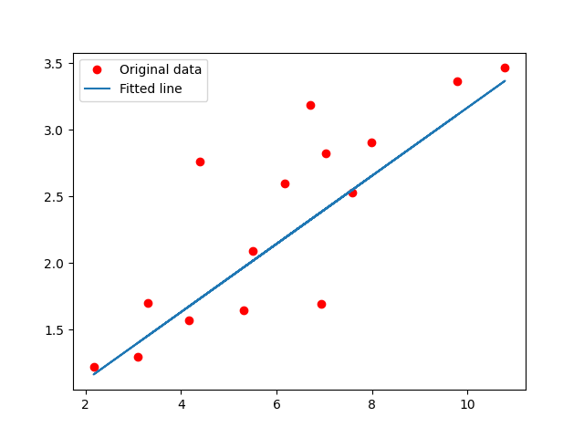
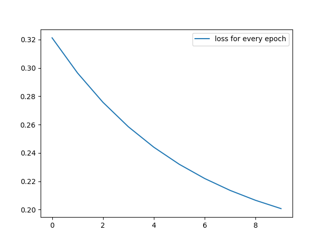

# exp0：PyTorch 线性回归入门实验

这个实验只保留最基础的 PyTorch 训练例子，用来理解“模型是怎么被训练出来的”。

## 整体过程

- 准备训练数据：输入 `x` 和目标值 `y`。
- 定义模型：用一个线性层表示 `y = wx + b` 这种关系。
- 定义 loss：衡量模型预测结果和真实答案差多少。
- 定义 optimizer：根据梯度更新模型里的参数。
- 执行训练循环：重复 forward、计算预测值和真实值之间的 loss、backward、step 不断更新模型参数，让模型逐渐拟合数据。
 
## 如何运行
```
source /Users/wendelin_ou/ml-workspace/venv/bin/activate
python train_linear.py
```


## 训练结果
- 线性回归拟合结果：如果拟合效果正常，线应该大致穿过这些红色数据点附近。
  
  - 红色点是原始训练数据；
  - 拟合线是模型训练后学出来的 `y = wx + b` 关系。
- Loss 变化曲线：表示每个 epoch 的 loss。一般来说，如果模型在正常学习，loss 应该整体呈下降趋势
  
