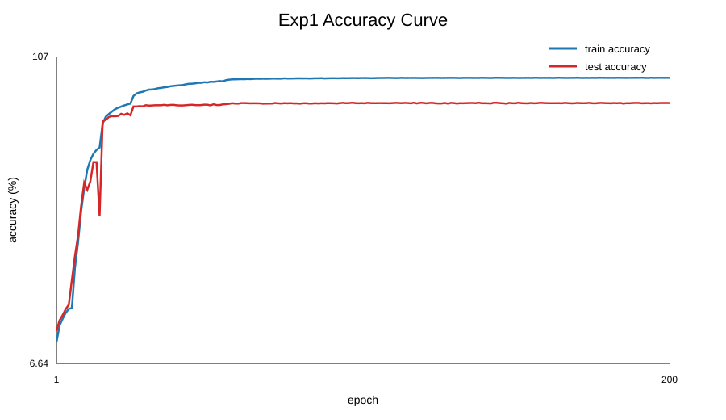
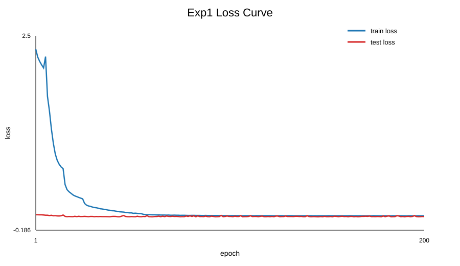

- [exp1：CIFAR-10 图像分类训练实验](#exp1cifar-10-图像分类训练实验)
  - [整体过程](#整体过程)
    - [其它文件/文件夹在实验里的作用](#其它文件文件夹在实验里的作用)
  - [结果 和 分析](#结果-和-分析)
  - [Questions](#questions)


# exp1：CIFAR-10 图像分类训练实验

## 整体过程
（Pytorch使用入门）

这个实验的主任务是用 PyTorch 在 CIFAR-10 上训练一个图像分类模型。CIFAR-10 每张图像是 `32x32` 的 RGB 图片，标签一共有 10 类：飞机、汽车、鸟、猫、鹿、狗、青蛙、马、船、卡车。

训练流程可以按代码执行顺序理解：

- `main.py` 是训练入口，负责解析命令行参数。
  ```bash
  python main.py --model resnet18 --steps 200 --lr 0.2 --gpu
  # --model resnet18：指定使用模型 resnet18（已写好）
  # --steps 200：训练 200 个 epoch
  # --lr 0.2：初始学习率为 0.2
  # --gpu：如果机器有 CUDA，就把模型和数据放到 GPU 上训练；
  # `--fp16`、`--loss_scaling`：可选的半精度训练相关参数。
  ```
- 解析完命令行参数后，`main.py` 传参数(model name)，通过 `models/model_factory_dict.py` 创建模型。
  - `models/` 文件夹里保存了多种网络结构定义，e.g. `resnet.py`、 `alexnet.py`、 `vgg.py`、 `mobilenet.py` 等；
    - `models/__init__.py` 把 `model_factory` 暴露出来；
    - `models/model_factory_dict.py` 维护“模型名称字符串 -> 模型构造函数”的映射；
  - 当命令行参数是 `--model resnet18` 时，实际会调用 `models/resnet.py` 里的 `ResNet18()`: 构造的是 `ResNet(BasicBlock, [2, 2, 2, 2])`，最后的全连接层输出 10 个值，对应 CIFAR-10 的 10 个类别。  
- `main.py` 把创建出的模型（模型名称、模型对象、模型学习率、学习率、是否使用 GPU、是否使用 FP16、是否使用 loss scaling）交给 `train.py` 里的 `Trainer` 类，得到 `Trainer` 类训练器对象 `trainer`。
  - `Trainer.__init__()` 保存模型、学习率、是否使用 GPU/FP16 等配置；
    - 初始化 对象属性 为 用户传进来的参数
    - 如果启用 GPU，会执行 `model.cuda()` 把模型移动到 GPU 显存上
    - 优化器使用 `optim.SGD(model.parameters(), lr, momentum=0.9, weight_decay=5e-4)`；
      - `momentum=0.9` 可以让参数更新带有“惯性”，通常收敛更稳；
      - `weight_decay=5e-4` 是 L2 正则化，用来抑制权重过大，减少过拟合；
    - 学习率调度器是 `MultiStepLR`，到 `[10, 20, 50, 100, 180]` 这些 epoch 时把学习率乘以 0.1
- `main.py` 导入 `data.py` 中的两个数据加载器对象 `trainloader`、`testloader`，完成数据准备。`data.py` 具体涉及：
  - 定义训练集和测试集的预处理流程：
    - 训练集使用 `train_transforms` (一种训练预处理流程)：
      - `RandomCrop(32, padding=4)`：先在原图四周补 4 像素，再随机裁回 `32x32`。这会让同一张图在不同 epoch 里稍微平移，模型不能只记住物体固定出现在某个像素位置，从而提升泛化能力。
        - 如果去掉它，训练集精度可能仍然很高，但测试集更容易下降。
      - `RandomHorizontalFlip()`：以 50% 概率水平翻转图片。CIFAR-10 里的车、飞机、猫、狗等左右翻转后类别通常不变，所以这相当于扩充训练数据。
        - 如果任务是识别文字、交通标志方向等，随便翻转就可能破坏标签。
      - `ToTensor()`：把 PIL/numpy 图像变成 PyTorch 张量，并把像素值从 `[0, 255]` 缩放到 `[0, 1]`。
        - 归一化后再做图像增强不方便，也容易破坏已经标准化好的数值分布，所以前两步先做图像增强。
      - `Normalize(mean, std)`：按 CIFAR-10 的 RGB 均值和标准差做标准化，让输入分布更稳定，通常能让梯度下降更容易收敛。
    - 测试集使用 `test_transforms` (一种训练预处理流程)：只做 `ToTensor()` 和 `Normalize()`；
      - 不做随机裁剪和随机翻转，因为测试时要稳定评估同一批图像，不能每次评估都随机改变输入。
  - `trainset` (训练集)、`testset` (测试集) 是 `torchvision.datasets.CIFAR10` 数据集对象
    - 每个训练集每次取出训练图片时，应用上面定义的训练预处理流程。
  - `trainloader`、`testloader` 是 `torch.utils.data.DataLoader` 对象，作用是把数据集切成一批一批的小 batch
    - `batch_size=128` 表示每次训练读 128 张图；
    - `shuffle=True` 表示每个 epoch 打乱样本顺序，避免模型总是按固定顺序见到数据；
    - `num_workers=4` 表示用 4 个子进程并行读取数据，加快喂数据速度。
- `main.py` 最后一行 `trainer.train_and_evaluate(trainloader, testloader, args.steps)` 开始训练和评估循环。外层循环跑 `steps` 次，也就是 epoch 数。每个 epoch:
  - 先调用 `train()` 在训练集上更新参数
    - `self.model.train()` 切换到训练模式，e.g. 启用 BatchNorm/Dropout 的训练行为
    - 设置 `train_loss` (累计训练 loss), `correct` (累计预测正确的样本数), `total` (累计已经处理过的样本数) 为 0
    - 设置当前 epoch 的学习率：
      - 前 5 个 epoch (从0开始计数) 使用 warmup，让学习率从较小值逐步升到设定的初始学习率，避免一开始步子太大导致训练不稳定；
      - 第 5 个 epoch：恢复到初始学习率；
      - 第 5 个 epoch 之后：每个 epoch 末尾调用 `self.scheduler.step();` :当 scheduler 走到 milestones=[10, 20, 50, 100, 180] 时，学习率会乘以 gamma=0.1
    - 定义损失函数 `nn.CrossEntropyLoss()`。
      - 分类任务通常不用 `MSELoss()`，因为模型输出的是每一类的 logits，交叉熵更适合“10 类里选 1 类”的监督学习；
    - 遍历训练集的每一个 batch，每个 batch 的训练顺序是：
      - 从 `trainloader` 取出 `inputs` 和 `targets`；
        - 如果使用 GPU，把数据移到 CUDA；
        - 清空上一轮 batch 留下的梯度
      - `outputs = self.model(inputs)` 前向传播，得到 10 类 logits；
      - `loss = criterion(outputs, targets)` 根据模型预测结果 outputs vs 真实训练标签 targets，计算分类损失；
      - `loss.backward()` 反向传播，根据 loss 计算模型每个参数的梯度
      - `optimizer.step()` 根据梯度更新模型参数；
      - 统计训练 loss `train_loss` 和 accuracy ( 根据 `total`, `correct`) ，并用 `utils.py` 的 `progress_bar()` 打印进度条。
        - 关于 `utils.py`：详情见注释
          - `progress_bar()`: 这个函数用到了 `format_time(seconds)`
          - `format_time(seconds)`: 耗时格式化
  - 再调用 `evaluate()` 在测试集上计算准确率
    - `self.model.eval()` 切换到评估模式；
    - 设置 `test_loss` (累计测试 loss), `correct` (累计预测正确的样本数), `total` (累计已经处理过的样本数) 为 0
    - 定义损失函数 `nn.CrossEntropyLoss()`, 这里的 loss 是“测试集预测结果 vs 测试集真实标签”。
      - 它不参与参数更新，只用于观察模型表现。
    - `with torch.no_grad()` 表示下面这段代码关闭梯度记录，节省显存和计算
      - 遍历测试集 `testloader` 的每一个 batch，每个 batch 做:
        - 从 `testloader` 取出测试图片 `test_x` 和测试标签 `test_y`
          - 如果使用 GPU，把数据移到 CUDA
        - 前向传播(用当前模型对测试图片做预测)、计算测试 loss
          - 不更新参数
        - 累计测试 loss 到 `test_loss`、累计测试样本数量到 `total`、累计预测正确的测试样本数量到 `correct`, 并用 `utils.py` 的 `progress_bar()` 打印进度条
          - `outputs.max(1)` 取 logits 最大的类别作为预测类别；
    - 计算当前 epoch 测试准确率 `acc`, 如果超过历史最好值 `self.best_acc`，就调用 `save_model()` 保存权重。
      - `./weights/` 是训练结果保存位置
        - 普通训练会保存到 `./weights/<model_name>/weights.<epoch>.<acc>.pt`；
        - FP16 训练会保存到 `./weights/<model_name>_fp16/`；
        - `.pt` 文件里保存了三项：`net` 模型参数、`acc` 准确率、`epoch` 轮数。


把这些步骤压缩成一句话就是：`main.py` 读参数，`data.py` 准备 CIFAR-10 batch，
`models/` 按名称创建网络，`train.py` 用交叉熵和 SGD 反复做前向传播、反向传播和参数更新，每个 epoch 后在测试集上评估，准确率创新高时把模型保存到 `weights/`。


### 其它文件/文件夹在实验里的作用
- `./data`: 保存下载下来的 CIFAR-10 数据集
- `./results_analysis/analyze_exp1_log.py`：日志分析脚本，负责从训练日志生成 CSV 和曲线图


## 结果 和 分析
- 硬件：拯救者 r9000p ( NVIDIA RTX 3060 GPU )
  操作系统 Ubuntu 22.04 
  总运行时长 about 2h 
  运行时 GPU temperature ~= (正常模式)86C - (性能模式)76C - 79C
- 运行 `run_exp1.sh` 后，脚本会自动把完整 terminal 输出日志放到  `./results_analysis/run_exp1_out.txt`: 
  - 里面经常会看到类似下面这种进度条输出, 表示“当前这个 epoch 里，训练集/测试集已经处理到哪里了，以及目前统计到的 loss 和 accuracy”
    ```bash
    [================================================================>]  Step: 496ms | Tot: 28s989ms | Loss: 2.319 | Acc: 13.536% (6768/50000) 391/391
    ```
    - `Step: 496ms`：这一次更新进度条距离上一次更新进度条花了多久。
      - 可以粗略理解成“最近一个 batch 用了多久”；
      - 但它也包含打印进度条、数据读取等额外开销，不一定只等于模型计算时间。
    - `Tot: 28s989ms`：从当前 训练 or 测试 阶段开始到现在，总共花了多久。
      > e.g. 训练阶段开始后，到当前 batch 一共用了约 28.989 秒。
    - `Loss: 2.319`：到目前为止的平均 loss。
      - 在 `train.py` 里是累计 `train_loss` 后除以已经处理的 batch 数；
      - loss 越小，通常说明模型预测和真实标签越接近；
      - 但单独看某一行 loss 意义不大，更重要的是看多个 epoch 中 loss 是否整体下降。
    - `Acc: 13.536% (6768/50000)`：到目前为止的累计准确率。
      - `6768` 表示目前预测正确的样本数；
      - `50000` 表示目前已经统计到的样本总数。这是训练阶段，分母最后会到 CIFAR-10 训练集大小 `50000`；
        - 如果这是测试阶段，分母最后会到 CIFAR-10 测试集大小 `10000`。
    - `391/391`：当前 batch 编号 / 总 batch 数。
      - 训练集有 `50000` 张图，`batch_size=128`，所以大约是 `50000 / 128 = 390.625`，向上取整就是 `391` 个 batch；
        - 所以 `391/391` 表示训练集这一轮已经跑到最后一个 batch；
      - 测试集有 `10000` 张图，`batch_size=128`，所以测试阶段通常会看到 `79/79`。
    - 这行里面里还会看到很多类似 `\b\b\b` 的奇怪字符（终端控制字符 `\b`），意思是“光标往左退一格”。
      - `utils.py` 里的 `progress_bar()` 用它来在终端同一行上刷新进度条。
      - 真实 terminal 会执行这些退格动作，所以你看到的是一条动态刷新的进度条；
      - 但是输出被保存到 txt 文件后，txt 不会执行退格动作，只会把这些控制字符原样保存下来，所以看起来像乱码。因此, 可以忽略这些 `\b\b\b`，重点看 `Step / Tot / Loss / Acc / 391/391` 这些字段。
- 运行 `run_exp1.sh` 的同时，脚本会自动从 `./results_analysis/run_exp1_out.txt` 里提取每个 epoch 的结果，并生成：
  - `./results_analysis/exp1_epoch_metrics.csv`：每个 epoch 一行的训练记录，主要列含义：
    - `epoch`：第几个 epoch，一共解析出 `200` 个 epoch
    - `learning_rate`：这一轮使用的学习率
    - `train_loss`：这一轮训练集上的平均 loss
    - `train_acc`：这一轮训练集上的准确率 = 训练精度
      - `train_correct / train_samples`：训练集中预测正确的样本数 / 训练样本总数
    - `test_loss`：这一轮测试集上的 loss
    - `test_acc`：这一轮测试集上的准确率，更能反映模型对没见过数据的泛化能力
      - `test_correct / test_samples`：测试集中预测正确的样本数 / 测试样本总数
      - 如果 `train_acc` 很高，但 `test_acc` 明显低很多，说明模型可能在训练集上记得很好，但泛化能力有限。
        - 模型只在 `train()` 里用训练集做 `loss.backward()` 和 `optimizer.step()`，也就是只根据训练集更新参数；
        - 测试集只在 `evaluate()` 里用来算准确率，不会执行反向传播，也不会更新参数。
  - `./results_analysis/exp1_accuracy_curve.png` / `./results_analysis/exp1_accuracy_curve.svg`：每张图都有 训练精度 = 训练准确率 `train accuracy` 曲线、测试准确率 `test accuracy` 曲线；
    

    - 训练后期 `train accuracy` 接近 100%，而 `test accuracy` 稳定在 91% 左右，说明模型已经基本把训练集学得很熟，但测试集还有约 8% 到 9% 的错误
      - 最佳训练准确率 = `99.786%`，出现在 epoch `164`
      - 最佳测试准确率 = `91.640%`，出现在 epoch `138`
      - 最后一个 epoch：`train_acc = 99.744%`，`test_acc = 91.530%`
  - `results_analysis/exp1_loss_curve.png` / `results_analysis/exp1_loss_curve.svg`：每张图都有 训练 loss 曲线、测试 loss 曲线。这张图用来观察 loss 是否整体下降。
    

    - 如果 Python 环境里有 `matplotlib`，会生成 `.png`；如果没有，会自动生成 `.svg`。
 

## Questions
`data.py`
??? 补注释后 还是不知道例如“RandomCrop对图像进行随机裁剪”到底有什么作用, i.e., 这是一套经典默认的、还是只是有个论文这么写 / 换一套别的预处理流程会有什么样的效果
